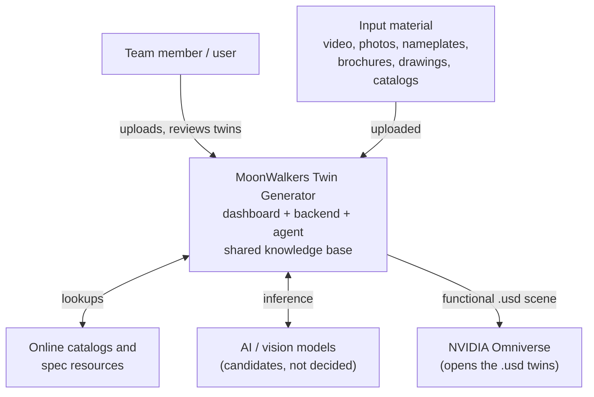
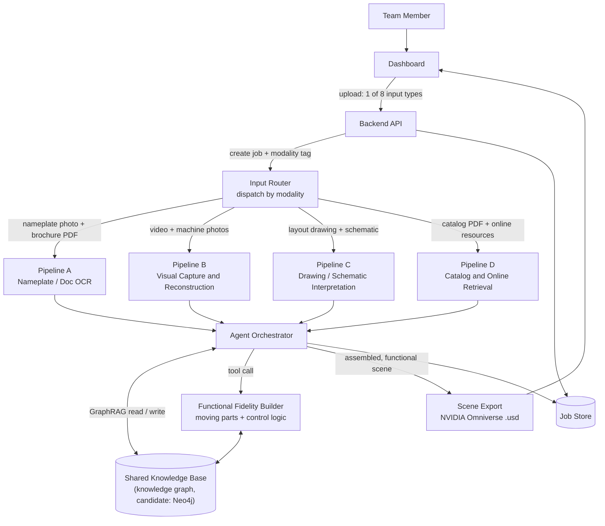
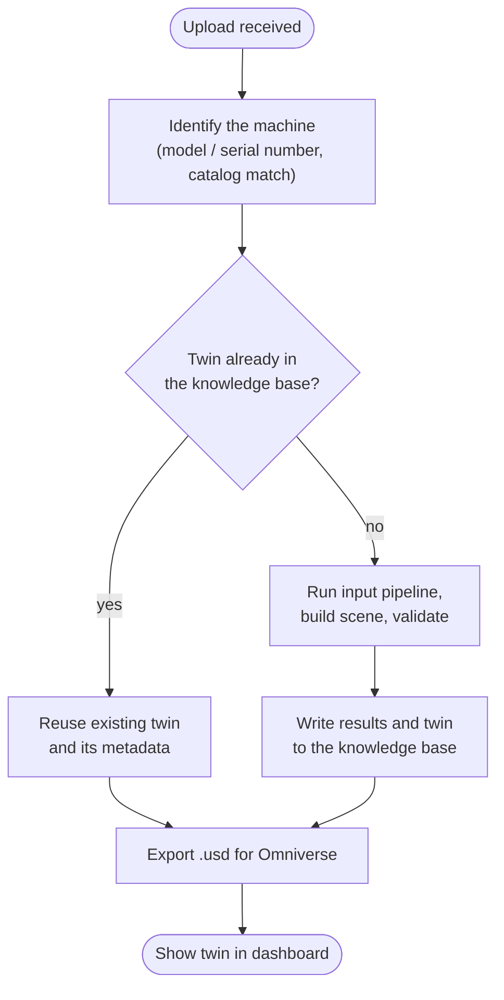
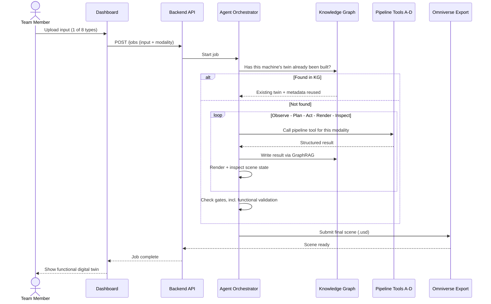
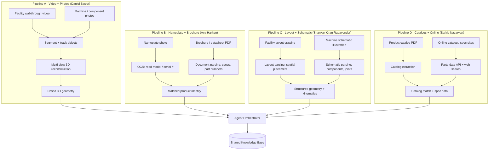
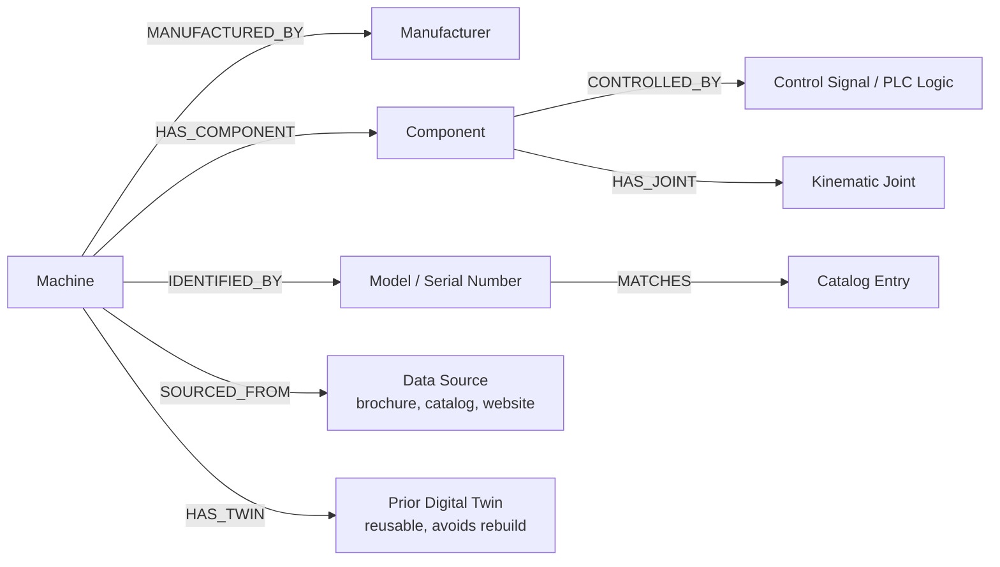
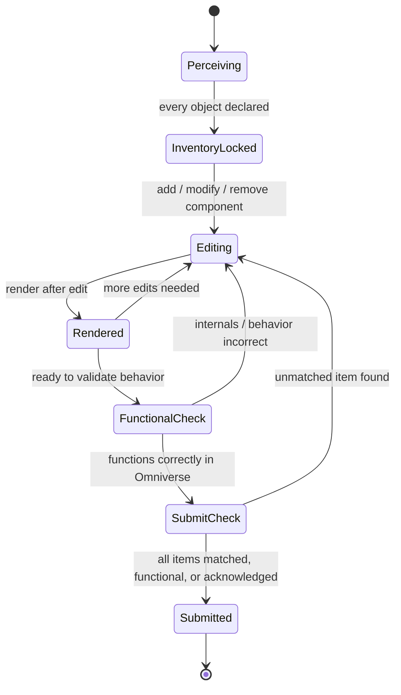
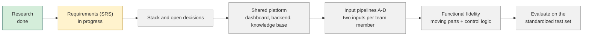

# MoonWalkers Multimodal Digital Twin Generator

> **Title awaiting approval.**

A multimodal AI-agent platform that turns everyday facility and equipment information (walkthrough video, photos, nameplates, brochures, drawings, catalogs) into **functional digital twins** exported as **NVIDIA Omniverse-compatible `.usd`** scenes, and stores what it learns in a shared knowledge base so a machine's twin never has to be rebuilt from scratch.

A capstone contribution to the **MoonWalkers collaborative platform** at CSUN's **ARCS** (Autonomy Research Center for STEAHM), built by a four-person team with guidance from faculty and NASA JPL advisors.

---

## Project status

**Planning and requirements phase. There is no runnable code in this repository yet.**

| Area | Status |
|---|---|
| Background research (digital twins, image-to-3D models, agents, prior MoonWalkers work) | Done |
| Scope and goals | Defined (see [What it does](#what-it-does)) |
| Software Requirements Specification (SRS) | Complete as of October 8th, 2026, written section by section by the team and awaiting stakeholder approval |
| Technology stack | **Awaiting Approval.** Options researched; see [Technology stack](#technology-stack-candidates) |
| Shared platform (dashboard, backend, knowledge base) | Not started |
| Input pipelines | Not started; all four have an owner (see [The four pipelines](#the-four-pipelines)) |

Everything below describes the **planned design**. Anything marked *candidate* has either not been decided by the team or not been approaved by the stakeholders.

---

## What it does

1. A user uploads one of up to **eight input types** through a dashboard.
2. An **agent** checks the shared knowledge base: has this machine's twin already been built?
3. If yes, it reuses the existing twin. If not, it runs the right input pipeline, writes what it learns to the knowledge base, builds and inspects the scene, and validates it.
4. The result is exported as a `.usd` scene that opens in NVIDIA Omniverse.

### What "functional" means here

The team's goal is a twin that **behaves like the real machine, not just looks like it**. The team's working definition (Oct 5, 2026) is both:

- **Moving parts** (articulation), and
- **Control logic** (how the machine is driven).

For example, a CNC machine's twin should have correct internals and behave like one in Omniverse, rather than being a hollow shell. The team has set this as the goal and the requirements are written as if time is available to see it fully realized.

Builds are expected to take a *reasonable amount of time*: not real-time, not exorbitant. No numeric target or limit has been agreed upon as of yet. More testing is likely needed

### The eight input types

| # | Input | Pipeline |
|---|---|---|
| 1 | Video of a facility walkthrough | A |
| 2 | Photos of machines / components | A |
| 3 | Photos of equipment nameplates | B |
| 4 | PDF product brochures / datasheets | B |
| 5 | Facility layout drawings | C |
| 6 | Schematic illustrations of machines | C |
| 7 | PDF product catalogs | D |
| 8 | Online product-catalog / technical-spec resources | D |

Each team member builds the pipeline for two inputs after the shared platform exists. Owners are listed under [The four pipelines](#the-four-pipelines).

---

## Architecture (planned)

### System context

Who and what the platform talks to. This view deliberately names no specific AI model, because the model and agent runtime have not been chosen.

### Component view

The Input Router sends each upload to one of four pipelines. Every pipeline reports to the agent orchestrator, which reads and writes the shared knowledge base, calls the Functional Fidelity Builder, and exports the scene.

### Twin reuse: the request flow

The knowledge base is checked first so that a machine already modeled is never rebuilt.

### Agent loop

### The four pipelines

Each pipeline handles a pair of inputs and has one owner. The models named in each box are **candidates from the team's research**, not final choices.

| Pipeline | Owner | Inputs | Candidate techniques (from research) |
|---|---|---|---|
| A | Daniel Sweet | Walkthrough video, machine/component photos | SAM 3 / SAM 2 for segmentation and tracking; VGGT for multi-view reconstruction |
| B | Ava Harken | Nameplate photos, brochures/datasheets | Ocean-OCR for scene text; document parsing |
| C | Shankar Kiran Ragavender | Layout drawings, schematic illustrations | Drawing/schematic interpretation to structured geometry and kinematics (approach not chosen) |
| D | Sarkis Nazaryan | PDF catalogs, online catalogs/specs | Catalog extraction; Octopart-style parts APIs for electronic components; web search for other equipment |

### Knowledge base schema (draft)

A draft of the entities and relationships the knowledge base would hold. It is a starting point for the SRS and will change. The `CONTROLLED_BY` and `HAS_JOINT` edges are what would let the Functional Fidelity Builder connect a machine's control logic to its physical structure.

### Submission gates

The agent cannot submit a scene until it passes these checks. `FunctionalCheck` separates "looks right" from "behaves right in Omniverse".

---

## Technology stack (proposal)

**Not yet approved.** The options below come from the team's weekly research, and none has been tested as of yet.

| Option | Summary |
|---|---|
| A | Python backend (FastAPI) + task queue (Celery) + React/TypeScript dashboard + Docker + a graph database via its Python driver |
| B | All Python, with a Gradio interface (lowest effort if the dashboard stays simple) |
| C | Node/TypeScript backend with Python workers |

What the research found:

- The similar projects reviewed (including two from Dr. Li's lab, AHa-3D, and NVlabs SAGE) are all Python-based research repositories.
- Isaac Sim can run headless and has a Docker container that needs the NVIDIA Container Toolkit.
- NVIDIA's Omniverse Web Viewer sample is React + TypeScript + Vite, so a live 3D view in the dashboard (a team wish, not a requirement) is possible in principle with a React front end and a GPU server.
- Isaac Sim's own livestream has no authentication or encryption, which matters for any shared deployment.
- **Neo4j** is likely the best suggestion for the knowledge graph. The AI model and agent runtime are also undecided.

### Hardware notes

- NVIDIA's Isaac Sim requirements page lists a minimum of GeForce RTX 4080 (16 GB) and states that GPUs without RT Cores (A100, H100) are not supported.
- TRELLIS.2, one candidate image-to-3D model, lists a requirement of an NVIDIA GPU with at least 24 GB; its README says it was verified on A100 and H100 and tested only on Linux.
- Which GPUs the team can use beyond its own machines is still an open question.

---

## Test data

The faculty advisor suggested a small, standardized test set: his own lab as a controlled capture environment, plus product data from six websites (BHS, Inc.; Made-in-China.com; Wheeler Machinery Sales; Grizzly Industrial; MASCO; and a Haas Automation model guide). These sources vary in reliability from personal testings.

---

## Roadmap

Planned order of work. No dates are committed.

---

## Open decisions

| Decision | State |
|---|---|
| Technology stack | Options researched; team decision pending |
| Knowledge graph technology (Neo4j suggested) | Suggestion only |
| AI model / agent runtime | Not decided |
| Product name | Not decided |
| Numeric time targets for a build | None agreed |
| Using a "digital cousin" as a fallback (in the ACDC paper, an asset that does not model a specific real-world counterpart but keeps similar geometry and semantics, unlike a twin) | Proposed in a team draft; pending advisor review |
| Whether the dashboard needs a live 3D view | Wished for, not a requirement |
| GPU availability and target Isaac Sim version | To be raised with the advisors |

---

## Related work

- Fei-Fei Li's lab: *Automated Creation of Digital Cousins for Robust Policy Learning* (ACDC), [arXiv:2410.07408](https://arxiv.org/abs/2410.07408)
- Dr. Li's lab (GitHub organization): [Digital-Twin-Interoperability](https://github.com/Digital-Twin-Interoperability), including [isaac-sim-reconstruction-benchmark](https://github.com/Digital-Twin-Interoperability/isaac-sim-reconstruction-benchmark) and [Automated-Digital-Twin-Generation-Pipeline](https://github.com/Digital-Twin-Interoperability/Automated-Digital-Twin-Generation-Pipeline)
- [AHa-3D](https://github.com/KevinXu02/aha-3d) and [NVlabs SAGE](https://github.com/NVlabs/sage): similar scene-generation pipelines
- Knowledge graphs for functional twins: [arXiv:2606.03255](https://arxiv.org/pdf/2606.03255), which links a machine's control logic to its kinematic model through a knowledge graph
- Articulation from images, text, or point clouds: [Articulate-Anything (arXiv:2410.13882)](https://arxiv.org/abs/2410.13882) and [URDF-Anything (arXiv:2511.00940)](https://arxiv.org/abs/2511.00940)
- Candidate perception models: [SAM 3](https://ai.meta.com/research/sam3/), [VGGT](https://arxiv.org/abs/2503.11651), [Ocean-OCR](https://arxiv.org/pdf/2501.15558), [TRELLIS.2](https://github.com/microsoft/TRELLIS.2)
- Prior MoonWalkers work: *Enabling Interoperable Digital Twins for Collaborative Lunar Exploration*, IEEE Aerospace 2025, [DOI 10.1109/AERO63441.2025.11068549](https://doi.org/10.1109/AERO63441.2025.11068549)
- Platform documentation: [Isaac Sim requirements](https://docs.isaacsim.omniverse.nvidia.com/latest/installation/requirements.html), [NVIDIA Omniverse Web Viewer sample](https://github.com/NVIDIA-Omniverse/web-viewer-sample), [GraphRAG vs. vector RAG (Neo4j)](https://neo4j.com/blog/agentic-ai/vector-rag-vs-graphrag/)

---

## Team

California State University, Northridge (CSUN), Computer Science capstone.

| Name | Role |
|---|---|
| Daniel Sweet | Team lead; Pipeline A (video + machine/component photos) |
| Ava Harken | Technical Lead; Pipeline B (nameplates + brochures/datasheets) |
| Shankar Kiran Ragavender | Pipeline C (layout drawings + schematics) |
| Sarkis Nazaryan | Pipeline D (PDF catalogs + online catalog/spec resources) |

**Course instructor:** Professor Xunfei Jiang

**Advisors and stakeholders:**

- Dr. Bingbing Li, faculty advisor and project stakeholder (Associate Director of ARCS; Associate Professor, Manufacturing Systems Engineering and Management, CSUN)
- Dr. Thomas Lu, senior researcher at NASA JPL; advisor to the team and a project stakeholder

---

## License

No license has been chosen yet for this repository. Until one is added the default copyright applies, meaning no one else may reproduce, distribute, or create derivative works from the code.
